# Báo cáo: Luồng Offline và Online của SQL Studio (`branch_sql_MVP`)

> Tài liệu mô tả **đúng theo mã nguồn hiện tại** hai luồng xử lý của hệ thống Text-to-SQL:
> luồng **offline** chuẩn bị dữ liệu một lần, và luồng **online** trả lời câu hỏi mỗi lần chạy.
> Mọi sơ đồ viết bằng Mermaid, hiển thị trực tiếp trên GitHub / VS Code.

## Mục lục

1. [Tổng quan hệ thống](#1-tổng-quan-hệ-thống)
2. [Luồng offline — chuẩn bị dữ liệu](#2-luồng-offline--chuẩn-bị-dữ-liệu)
3. [Luồng online — trả lời câu hỏi](#3-luồng-online--trả-lời-câu-hỏi)
4. [Giám sát và debug](#4-giám-sát-và-debug)
5. [Giới hạn đã biết](#5-giới-hạn-đã-biết)
6. [Tham chiếu mã nguồn](#6-tham-chiếu-mã-nguồn)

---

## 1. Tổng quan hệ thống

Hệ thống nhận **một database SQLite** và **một tài liệu nghiệp vụ** mô tả database đó, rồi cho phép
người dùng hỏi bằng tiếng Việt và nhận lại **câu SQL, bảng kết quả thật và câu trả lời**.

| | Luồng offline | Luồng online |
|---|---|---|
| **Mục đích** | Biến dữ liệu thô thành các artifact dùng để truy hồi | Sinh SQL, thực thi và trả lời một câu hỏi |
| **Khi nào chạy** | Một lần cho mỗi phiên bản dataset | Mỗi lần người dùng bấm Chạy |
| **Đầu vào** | File SQLite + tài liệu nghiệp vụ (`.md/.docx/.pdf/.xlsx`) | Câu hỏi + dataset đã chuẩn bị |
| **Đầu ra** | Schema catalog, event index, chunk, vector, Qdrant collection, `dataset.json` | SQL, kết quả truy vấn, câu trả lời |
| **Gọi LLM?** | Không (trừ nhánh GraphRAG tùy chọn) | Có — sinh SQL, trả lời, và tùy pipeline: định tuyến, chọn bằng chứng, sửa lỗi |

Cả hai luồng đều là **workflow đồ thị** chạy trên cùng một bộ máy: định nghĩa node (JSON) được
biên dịch thành `StateGraph` của LangGraph ([compiler.py](../src/branch_sql_MVP/workflow/compiler.py)),
thực thi bởi `RunManager` và ghi lại từng sự kiện vào SQLite để giao diện theo dõi.

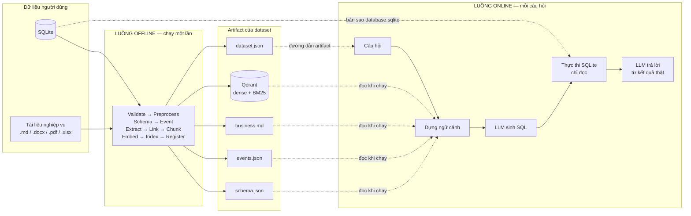

---

## 2. Luồng offline — chuẩn bị dữ liệu

### 2.1. Ba cách khởi chạy

Cả ba cách đều tạo ra **cùng một workflow offline** bằng hàm `offline_template()`
([templates.py](../src/branch_sql_MVP/workflow/templates.py)), nên kết quả giống nhau.

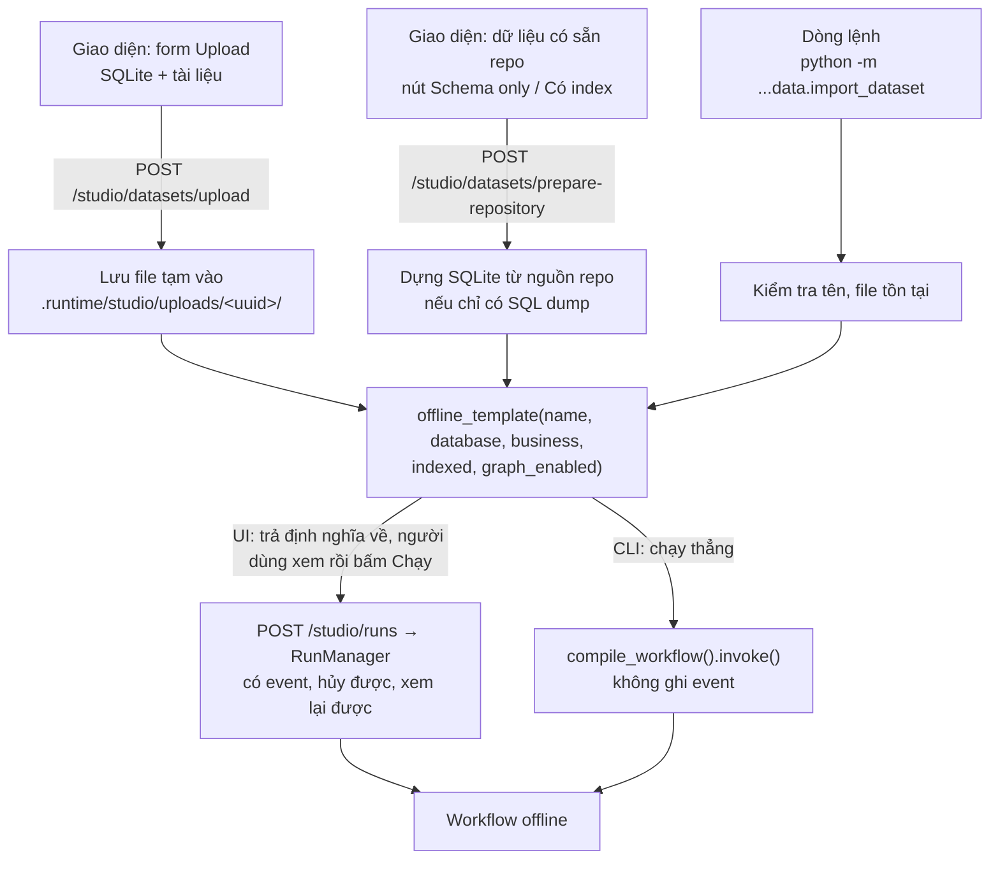

> Upload **không tự chạy** pipeline: server chỉ lưu file và trả về định nghĩa workflow để người
> dùng kiểm tra từng node trước khi bấm Chạy. Chọn **GraphRAG** khi upload sẽ tự bật luôn index.

### 2.2. Sơ đồ pipeline offline

Pipeline luôn là một **chuỗi tuyến tính**. Số bước phụ thuộc hai lựa chọn:

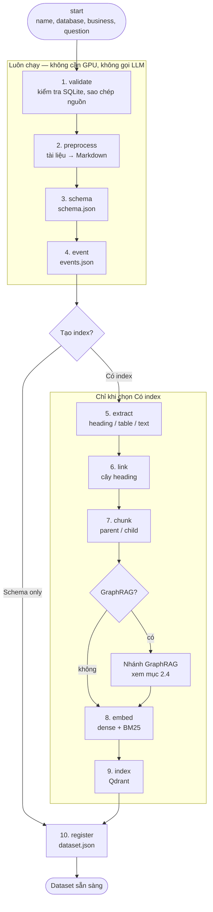

| Lựa chọn | Các bước | Pipeline online dùng được |
|---|---|---|
| **Schema only** | validate → preprocess → schema → event → register (5 bước + start) | Chỉ `P1-full` (Prompt cơ bản) |
| **Có index** | Thêm extract → link → chunk → embed → index (10 bước + start) | Cả 8 pipeline |
| **Có index + GraphRAG** | Thêm 5 node GraphRAG sau chunk | Cả 8 pipeline, kèm collection graph |

### 2.3. Chi tiết từng bước

Mọi bước đều đi qua một adapter chung `stage()` ([nodes/offline.py](../src/branch_sql_MVP/workflow/nodes/offline.py)).
Đầu ra của bước trước được **trải toàn bộ** sang bước sau qua input `"$"`, nên mỗi bước nhận đủ
đường dẫn các artifact đã tạo. Tất cả artifact nằm trong `.runtime/studio/datasets/<name>/`.

| # | Bước | Làm gì | Ghi ra | Mã nguồn |
|---|---|---|---|---|
| 1 | **validate** | Đọc schema file SQLite nguồn để chắc chắn đọc được. Sao chép database và tài liệu vào thư mục dataset. Nếu bản sao đã có mà **nội dung nguồn khác** (so SHA-256) thì từ chối, yêu cầu đặt tên phiên bản mới. | `database.sqlite`, `<name>_business.<ext>` | `nodes/offline.py` |
| 2 | **preprocess** | Chuyển tài liệu sang Markdown theo định dạng: `.md` giữ nguyên, `.docx`/`.pdf`/`.xlsx`/`.sql` dùng parser riêng. Sinh `doc_id` dạng slug không dấu. Báo lỗi nếu Markdown rỗng. | `markdown/<doc_id>.md`, `business.md` | [offline/pipeline.py](../src/branch_sql_MVP/offline/pipeline.py) |
| 3 | **schema** | Dựng **schema catalog** từ SQLite: mọi bảng, cột (kiểu, nullable, khóa chính, mặc định, mô tả nghiệp vụ nếu có), **khóa ngoại** (tự suy ra cột đích từ khóa chính nếu thiếu), DDL gốc, và **tối đa 8 giá trị mẫu khác nhau mỗi cột** (cắt ở 120 ký tự, không quét toàn bảng). Kèm fingerprint SHA-256. | `schema.json` | [offline/schema_catalog.py](../src/branch_sql_MVP/offline/schema_catalog.py) |
| 4 | **event** | Dựng **đồ thị event–entity** không dùng LLM. *Entity* là bảng và cột. *Event* có 3 loại: `table_structure` (bảng gồm các cột nào), `foreign_key` (cột nào tham chiếu cột nào), `business_rule` (tài liệu tách theo heading `##`/`###`, mỗi phần cắt thành khối ≤ 1.200 ký tự). Cạnh `mentions` nối event với entity khi tên bảng/cột xuất hiện trong nội dung (so khớp regex theo ranh giới từ). | `events.json` | [offline/event_index.py](../src/branch_sql_MVP/offline/event_index.py) |
| 5 | **extract** | Phân tích Markdown (CommonMark + bảng) thành đúng 3 loại phần tử: `heading` (kèm cấp), `table`, `text`. | `artifacts/<doc_id>.extract.json` | [offline/extract.py](../src/branch_sql_MVP/offline/extract.py) |
| 6 | **link** | Gắn `parent_id` cho mỗi phần tử theo **cây heading** (phần tử thuộc heading gần nhất có cấp nhỏ hơn). | `artifacts/<doc_id>.linked.json` | [offline/link.py](../src/branch_sql_MVP/offline/link.py) |
| 7 | **chunk** | Chia thành **parent chunk** (trả về cho LLM) và **child chunk** (dùng để tìm kiếm). Chọn tự động 1 trong 3 chiến lược theo cấu trúc tài liệu — xem bảng ngay dưới. Đếm token bằng tokenizer của model embedding. Kiểm tra cuối: không có chunk rỗng, quá dài, quá ngắn hay mồ côi. | `artifacts/<doc_id>.chunks.jsonl`, `.parents.jsonl` | [offline/chunk.py](../src/branch_sql_MVP/offline/chunk.py) |
| 8 | **embed** | Tạo 2 vector cho mỗi child chunk: **dense** bằng `AITeamVN/Vietnamese_Embedding` và **sparse BM25** bằng `Qdrant/bm25`. Kiểm tra số vector và số chiều khớp. Nếu có GraphRAG, embed thêm entity và community report. | `artifacts/<doc_id>.vectors.jsonl` | [offline/embed.py](../src/branch_sql_MVP/offline/embed.py) |
| 9 | **index** | Ghi các điểm vào **Qdrant cục bộ** (`.runtime/studio/qdrant`). Payload mỗi điểm chứa child chunk và **toàn văn parent** (`parent_text`). Tên collection gắn fingerprint: `studio_<name>__docs_<16 ký tự>`, nên đổi cấu hình sẽ tạo collection mới thay vì xóa collection cũ. Sau khi ghi, **đếm lại số điểm** phải bằng số chunk. | Collection Qdrant | [offline/index.py](../src/branch_sql_MVP/offline/index.py) |
| 10 | **register** | Ghi bản ghi dataset: `id`, `doc_id`, `knowledge_id = studio_<name>`, tên collection, `revision` (hash database + tài liệu), và **capabilities** (`schema`, `business`, `event`, `index`, `graph`). Trạng thái chuyển thành `ready`. | `dataset.json` | `nodes/offline.py` |

**Ba chiến lược chunk**, thử lần lượt từ trên xuống; chiến lược đầu tiên khớp được dùng:

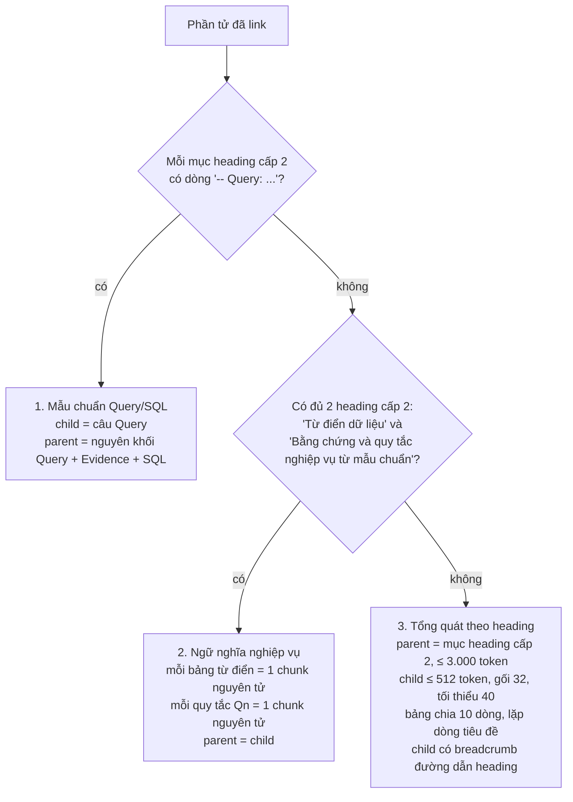

Chiến lược 3 gộp các child ngắn hơn 40 token vào child kề bên; không gộp được mà vẫn giữ giới hạn
512 token thì bỏ. Nếu tài liệu không có heading cấp 2 hoặc quá ngắn, bước này báo lỗi
*"chunk yêu cầu H2, tài liệu chỉ có: …"* hoặc *"chunk tạo ra 0 child chunk"*: đó là do cấu trúc
tài liệu hoặc ngưỡng chunk, không phải lỗi LLM. Có thể hạ `heading_level` / `child_min` riêng
cho node **Chunk** trong mục Nâng cao.

### 2.4. Nhánh GraphRAG (tùy chọn)

Đây là **phần duy nhất của luồng offline gọi LLM**. Nó chèn sau bước `chunk` và dùng hai node
`foreach` — mỗi foreach chạy một **luồng con** cho từng phần tử, song song tối đa 3 luồng.

```mermaid
flowchart LR
    CH["chunk"] --> GP["graph_prepare<br/>nạp chunk, áp max_chunks"]

    subgraph FE1["graph_extract — foreach mỗi chunk"]
        direction LR
        S1(["start: item = chunk"]) --> L1["LLM extract_llm<br/>trích entity và quan hệ<br/>theo schema ExtractedGraph"]
    end

    GP --> FE1
    FE1 --> RS["graph_resolve<br/>hợp nhất entity trùng,<br/>phát hiện community"]

    subgraph FE2["graph_reports — foreach mỗi community"]
        direction LR
        S2(["start: item = community"]) --> L2["LLM report_llm<br/>tóm tắt community<br/>theo schema CommunitySummary"]
    end

    RS --> FE2
    FE2 --> GW["graph_write<br/>artifacts/&lt;doc_id&gt;.graph.json"]
    GW --> EM["embed<br/>+ vector entity / report"]
    EM --> IX["index<br/>+ collection graph"]
```

- Loại entity cho phép: `table`, `column`, `metric`, `business_rule`, `filter_value`, `sql_function`.
- Provider / model / temperature của hai node LLM lấy từ mục `graph` trong Settings, độc lập với model sinh SQL.
- `graph_resolve` báo lỗi nếu không trích được entity nào.

### 2.5. Cache, resume và trạng thái

Mỗi bước tự quyết định **chạy lại hay dùng lại kết quả cũ**, để một lần import thất bại giữa
chừng có thể chạy tiếp mà không làm lại từ đầu.

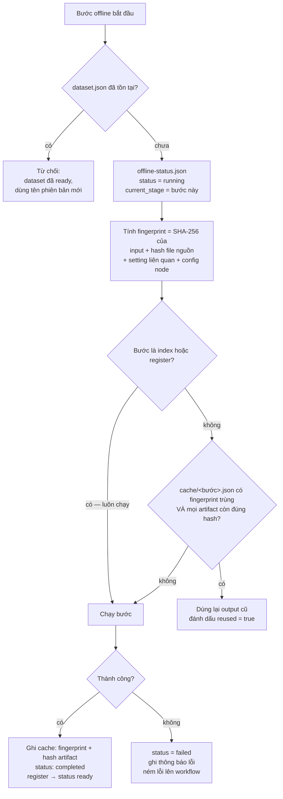

- **Setting nào làm bước nào chạy lại:** `preprocess` ↔ mục `preprocess`; `chunk` ↔ `chunk`;
  `embed` ↔ `embedding`; `index` ↔ `index`. Ví dụ đổi prompt trả lời **không** làm index cũ bị coi là lỗi thời.
- **Ghi an toàn:** mọi file trạng thái và cache ghi kiểu atomic; các bước dùng chung một khóa
  (`RLock`) trong một tiến trình.
- **Theo dõi:** `GET /studio/datasets/status` đọc mọi `offline-status.json`; giao diện hiển thị ở trang *Dữ liệu & Offline*.

### 2.6. Cấu trúc thư mục artifact

```text
src/branch_sql_MVP/.runtime/studio/
├── datasets/<name>/
│   ├── database.sqlite            ← bản sao database (online thực thi SQL trên file này)
│   ├── <name>_business.<ext>      ← bản sao tài liệu gốc
│   ├── business.md                ← tài liệu dạng Markdown (P1 đưa thẳng vào prompt)
│   ├── schema.json                ← schema catalog
│   ├── events.json                ← đồ thị event–entity
│   ├── markdown/<doc_id>.md
│   ├── artifacts/                 ← chỉ khi có index
│   │   ├── <doc_id>.extract.json
│   │   ├── <doc_id>.linked.json
│   │   ├── <doc_id>.chunks.jsonl
│   │   ├── <doc_id>.parents.jsonl
│   │   ├── <doc_id>.vectors.jsonl
│   │   └── <doc_id>.graph.json    ← chỉ khi có GraphRAG
│   ├── cache/<bước>.json          ← fingerprint + hash artifact từng bước
│   ├── offline-status.json        ← trạng thái, bước hiện tại, lỗi
│   └── dataset.json               ← bản ghi đăng ký; có file này = ready
├── qdrant/                        ← Qdrant cục bộ, dùng chung mọi dataset
├── uploads/<uuid>/                ← file tạm từ form upload
├── workflows/                     ← cấu hình pipeline đã lưu (kèm revisions/)
└── runs/runs.sqlite               ← lịch sử run và event
```

### 2.7. Ràng buộc bảo vệ dữ liệu

| Ràng buộc | Nơi kiểm tra |
|---|---|
| Tên dataset phải khớp `[a-z][a-z0-9_]{0,63}` | `stage()`, API upload, CLI |
| Dataset đã `ready` **không bao giờ bị ghi đè** — muốn đổi dữ liệu phải import tên mới | `stage()` và `POST /studio/runs` |
| Nguồn thay đổi so với bản đã sao chép → từ chối | bước `validate` |
| Online từ chối nếu hash `database.sqlite` + `business.md` khác `revision` lúc đăng ký | `POST /studio/runs` |
| Pipeline cần index mà dataset chỉ có schema → từ chối | `POST /studio/runs` (`requires_index`) |

---

## 3. Luồng online — trả lời câu hỏi

### 3.1. Từ lúc bấm Chạy đến khi có kết quả

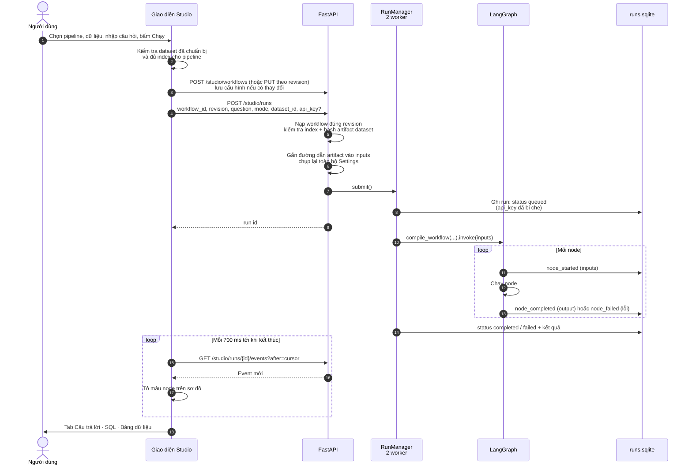

Hai điểm quan trọng:

- **Settings được chụp lại lúc submit.** Sửa Settings trong khi đang chạy không ảnh hưởng run đó.
- **API key không bao giờ được lưu.** Key nhập trên giao diện chỉ đi kèm request; `sanitize()`
  thay key bằng `[redacted]` trong mọi event, kết quả và thông báo lỗi trước khi ghi SQLite.
  Nếu không nhập, server dùng biến môi trường của provider (ví dụ `GOOGLE_API_KEY`) trong
  `src/branch_sql_MVP/.env`.

### 3.2. Đầu vào của node `start`

API tự bổ sung đầu vào từ `dataset.json`, nên mọi pipeline đều nhận cùng một bộ:

| Khóa | Nguồn | Dùng bởi |
|---|---|---|
| `question` | Người dùng (trống thì lấy câu mặc định của dataset) | Mọi node |
| `mode` | `answer` hoặc `sql_only` | Node rẽ nhánh `mode` |
| `evidence`, `difficulty` | Mặc định `""`, `"unknown"` | Dựng ngữ cảnh, router G1 |
| `database` | `datasets/<name>/database.sqlite` | Thực thi SQL |
| `schema_catalog_path` | `schema.json` | Schema / value linking, full context |
| `business_path` | `business.md` | Full context (P1) |
| `event_index_path` | `events.json` | Node `events` |
| `knowledge_id`, `doc_id` | `dataset.json` | Truy hồi Qdrant |

### 3.3. Khung chung của 8 pipeline

Cả 8 pipeline được **sinh từ cùng một hàm** `make_template()` theo tham số trong
[pipeline/presets.json](../src/branch_sql_MVP/pipeline/presets.json). Chúng chỉ khác nhau ở
**ba khối có thể thay thế** (tô màu trong sơ đồ); phần sau khi có SQL luôn giống nhau.

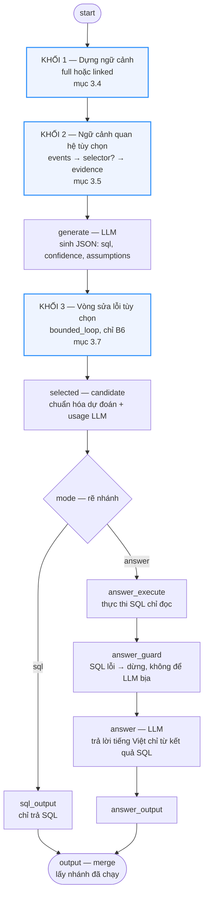

- **Rẽ nhánh có điều kiện** là cạnh `condition` của LangGraph: node `branch` trả `route`, chỉ nhánh khớp được chạy.
- **`answer_guard`** chặn trường hợp SQL thực thi lỗi: thay vì để LLM diễn giải một lỗi, run dừng với thông báo rõ.
- Prompt trả lời bắt buộc: nếu kết quả rỗng thì nói không có dòng; nếu kết quả bị giới hạn thì nêu rõ, không coi số dòng hiển thị là tổng số dòng.

### 3.4. Khối 1 — Dựng ngữ cảnh

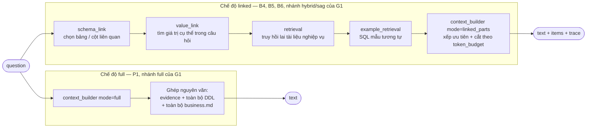

**Chi tiết chế độ linked:**

| Node | Cách làm | Tham số preset |
|---|---|---|
| `schema_link` | Chấm điểm từng bảng / cột bằng từ vựng, **không gọi LLM**: `3 × tên xuất hiện nguyên văn + 1,5 × tỉ lệ từ trùng + 0,5 × độ giống mờ` (SequenceMatcher), trên chữ đã bỏ dấu. Bảng trả về DDL, cột trả về kiểu và mô tả. **Tự thêm mọi khóa ngoại** chạm tới các bảng đã chọn để LLM có đường JOIN. | `table_k = 8`, `column_k = 20`, `schema_min_score = 0.12` |
| `value_link` | So câu hỏi với **giá trị mẫu** trong schema catalog. Nhận một giá trị khi: xuất hiện nguyên văn, **hoặc** độ giống mờ với một từ ≥ ngưỡng, **hoặc** ≥ 50% số từ của giá trị có trong câu hỏi. Giúp LLM viết đúng hằng số trong `WHERE`. | `value_k = 8`, `value_fuzzy_threshold = 0.84` |
| `retrieval` | Truy hồi lai trên Qdrant, lọc đúng `doc_id` của dataset — xem mục 3.6 | `candidate_k = 16`, `docs_top_k = 5` |
| `example_retrieval` | Tìm SQL mẫu từ tập train nếu có | `example_k = 0` — **đang tắt trong cả 8 preset** |
| `context_builder` | Gộp mọi bằng chứng, **sắp theo ưu tiên** `schema → value → business → example → event` rồi theo điểm, giữ tới khi chạm ngân sách token (ước lượng 4 ký tự ≈ 1 token). Mỗi quyết định giữ / loại được ghi vào `trace`. | `token_budget = 5000` |

### 3.5. Khối 2 — Ngữ cảnh quan hệ (event–entity)

Dùng file `events.json` từ bước offline `event` để bổ sung **quan hệ giữa bảng, cột và quy tắc
nghiệp vụ** mà truy hồi văn bản thông thường bỏ sót.

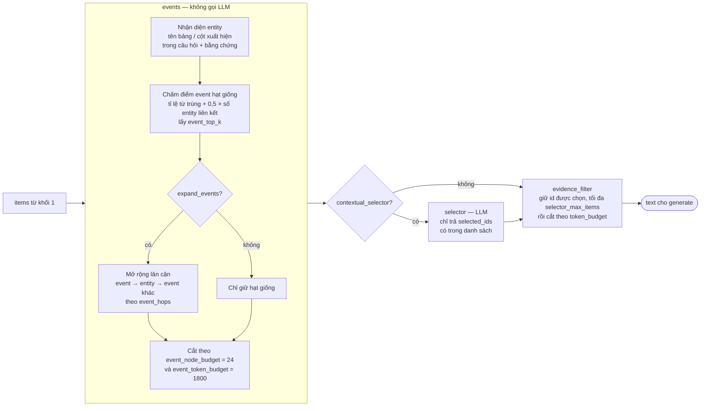

- Prompt của `selector` dặn LLM **không làm theo chỉ thị nằm trong bằng chứng** (chống prompt injection từ tài liệu).
- Kể cả khi LLM đã chọn, `evidence_filter` **vẫn áp ngân sách token** để prompt sinh SQL không phình to.

### 3.6. Truy hồi lai (hybrid retrieval)

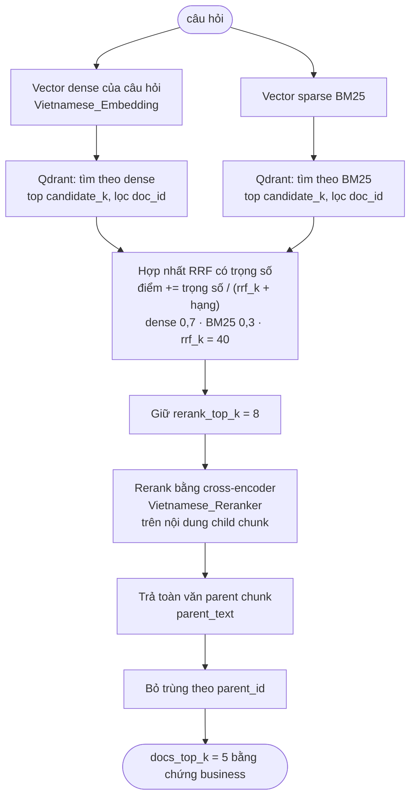

- **Chấm điểm bằng child chunk ngắn, nhưng trả về parent chunk dài.** Nhờ vậy khớp chính xác mà LLM vẫn đủ ngữ cảnh.
- Hệ thống kiểm tra model embedding và reranker **cùng họ** trước khi truy hồi lai.
- Reranker chạy tuần tự bằng một khóa để tránh tranh chấp GPU khi nhiều run song song.

### 3.7. Khối 3 — Vòng sửa lỗi SQL (B6)

`repair_loop` là node `bounded_loop`: chạy lặp một **luồng con** với số vòng tối đa cố định.

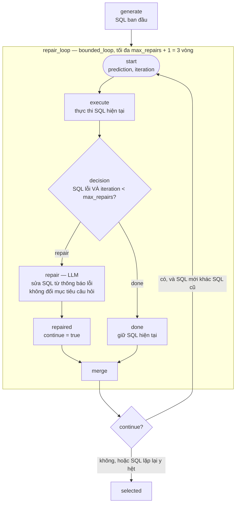

- Trạng thái `success` hoặc `empty_result` được coi là **đúng**, không sửa.
- Nếu LLM trả lại **đúng câu SQL cũ**, vòng lặp dừng sớm (`stop_on_repeat_output`) để không tốn lượt gọi.
- Tối đa **2 lần gọi LLM sửa lỗi** và 3 lần thực thi.

### 3.8. Pipeline thích ứng G1

G1 để **LLM tự chọn chiến lược** theo độ khó câu hỏi, rồi sinh SQL qua một node `foreach`.

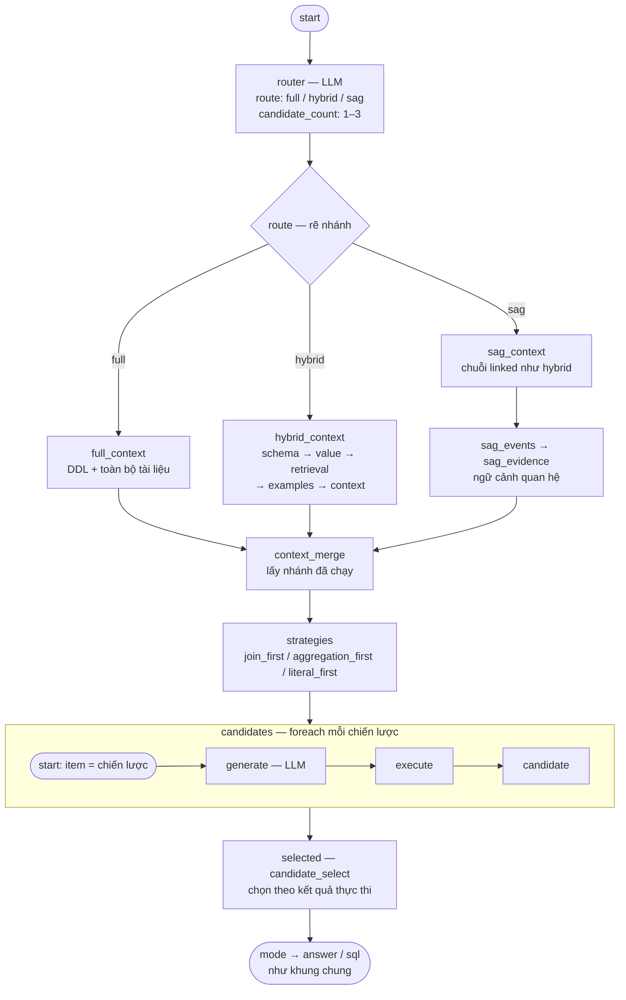

- **Số ứng viên thực tế bị giới hạn bởi preset:** `route.max_candidates = 1`, nên dù router đề xuất 3 thì vẫn chỉ sinh **1** ứng viên. Node LLM `choose` chỉ được thêm vào khi `max_candidates > 1`.
- G1 luôn cần index, **kể cả khi router chọn `full`**, vì các nhánh còn lại dùng truy hồi.

### 3.9. Thực thi SQL an toàn và chấm ứng viên

**Thực thi** ([online/sql_execution.py](../src/branch_sql_MVP/online/sql_execution.py)) có 5 lớp bảo vệ:

| Lớp | Cơ chế |
|---|---|
| 1. Chỉ câu đọc | Regex chỉ nhận `SELECT`, `WITH`, `EXPLAIN` (bỏ qua comment đầu câu) |
| 2. Mở file chỉ đọc | URI `mode=ro&immutable=1` |
| 3. Khóa ghi trong phiên | `PRAGMA query_only = ON` |
| 4. Bộ lọc hành động | `set_authorizer` chỉ cho phép SELECT / READ / FUNCTION / RECURSIVE |
| 5. Giới hạn tài nguyên | Hết giờ sau 5 giây (progress handler); tối đa 500 dòng, đánh dấu `truncated` nếu còn |

Kết quả luôn là một **observation** có `status`, được dùng để quyết định sửa lỗi và chọn ứng viên:

| `status` | Ý nghĩa | Điểm chọn ứng viên |
|---|---|---|
| `success` | Có dòng kết quả | 5,0 |
| `empty_result` | Chạy đúng, 0 dòng | 4,0 |
| `runtime_error`, `type_value_error` | Lỗi khi chạy / sai kiểu | 1,0 |
| `schema_error`, `missing_object` | Sai bảng / cột | 0,5 |
| `syntax_error` | Sai cú pháp | 0,0 |
| `timeout` | Quá 5 giây | −1,0 |
| `policy_violation` | Không phải câu đọc | −2,0 |

Khi có nhiều ứng viên, xếp hạng theo: **điểm trạng thái → `confidence` do LLM tự đánh giá → SQL
ngắn hơn**. Cách chọn này **không cần đáp án chuẩn**. Nếu LLM `choose` chọn một ứng viên lỗi trong
khi có ứng viên chạy đúng, hệ thống ghi đè bằng ứng viên tốt nhất.

### 3.10. So sánh 8 pipeline

| Pipeline | Tên hiển thị | Ngữ cảnh | Quan hệ | Selector LLM | Sửa lỗi | Cần index | Số lần gọi LLM (chế độ answer) |
|---|---|---|---|---|---|---|---|
| `P1-full` | Prompt cơ bản | full | — | — | — | Không | **2** — generate, answer |
| `B4-hybrid` | Truy hồi lai | linked | — | — | — | Có | **2** |
| `B4-event-seeds` | Sự kiện — hạt giống | linked | hạt giống, `event_top_k = 4` | — | — | Có | **2** |
| `B4-event-expansion` | Sự kiện — mở rộng | linked | mở rộng 1 bước | — | — | Có | **2** |
| `B5-selector` | Chọn bằng chứng bằng LLM | linked | mở rộng 1 bước | ✓ tối đa 12 | — | Có | **3** — + selector |
| `B6-relational` | Ngữ cảnh quan hệ + sửa lỗi | linked | mở rộng 1 bước | ✓ tối đa 24 | ✓ ≤ 2 | Có | **3–5** |
| `B6-hybrid` | Truy hồi lai + sửa lỗi | linked | — | — | ✓ ≤ 2 | Có | **2–4** |
| `G1-adaptive` | Định tuyến thích ứng | router chọn | chỉ nhánh `sag` | — | — | Có | **3** — + router |

Chế độ `sql_only` bớt đi 1 lần gọi (không có node `answer`).

---

## 4. Giám sát và debug

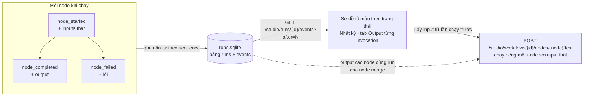

- **Event bền vững:** mỗi event có số `sequence` tăng dần. Mất kết nối hay tải lại trang vẫn đọc tiếp được từ vị trí cũ.
- **Node trong vòng lặp** mang `scope` dạng `<node cha>/<invocation>`, nên mỗi lần lặp được xem riêng.
- **Chạy riêng một node** không chạy lại các node trước nó. Nếu chọn một run cũ, node dùng lại Settings đã chụp của run đó.
- **Hủy run** dừng tại ranh giới node kế tiếp. Không ngắt được một lời gọi API hay GPU đang chạy dở.
- Run đang dở khi server tắt được đánh dấu `interrupted` ở lần khởi động sau.

---

## 5. Giới hạn đã biết

| Vấn đề | Ảnh hưởng |
|---|---|
| Chưa có kiểm thử end-to-end với **LLM thật**; test hiện dùng model giả | Chưa đo được chất lượng SQL thực tế trên dataset người dùng |
| `example_k = 0` trong cả 8 preset | Node `example_retrieval` có trong sơ đồ nhưng không đóng góp bằng chứng |
| G1 giới hạn `max_candidates = 1` | Không có so sánh nhiều ứng viên dù router đề xuất nhiều hơn |
| Mọi ngữ cảnh linked luôn chèn một mục `BIRD evidence` (ghi "Không có" khi trống) | Dư một mục thừa trong prompt với dữ liệu ngoài bộ BIRD |
| Ước lượng token bằng `số ký tự / 4` | Ngân sách không chính xác với tiếng Việt có dấu |
| GraphRAG chưa cache từng lời gọi LLM trích xuất / báo cáo | Chạy lại GraphRAG gọi lại toàn bộ LLM |
| Dataset đã `ready` không sửa được | Muốn đổi dữ liệu phải import dưới tên phiên bản mới |
| Chỉ một tiến trình app được dùng Qdrant cục bộ | Không chạy song song nhiều server trên cùng thư mục `.runtime` |

---

## 6. Tham chiếu mã nguồn

| Thành phần | File |
|---|---|
| Định nghĩa 8 pipeline + workflow offline | [workflow/templates.py](../src/branch_sql_MVP/workflow/templates.py) |
| Tham số từng pipeline | [pipeline/presets.json](../src/branch_sql_MVP/pipeline/presets.json) |
| Biên dịch đồ thị, vòng lặp, foreach, rẽ nhánh | [workflow/compiler.py](../src/branch_sql_MVP/workflow/compiler.py) |
| Thực thi nền, event, che API key | [workflow/runtime.py](../src/branch_sql_MVP/workflow/runtime.py) |
| Danh sách loại node | [workflow/registry.py](../src/branch_sql_MVP/workflow/registry.py) |
| Adapter các bước offline, cache, trạng thái | [workflow/nodes/offline.py](../src/branch_sql_MVP/workflow/nodes/offline.py) |
| GraphRAG | [workflow/nodes/offline_graph.py](../src/branch_sql_MVP/workflow/nodes/offline_graph.py), [offline/graph.py](../src/branch_sql_MVP/offline/graph.py) |
| Node LLM dùng chung | [workflow/nodes/llm.py](../src/branch_sql_MVP/workflow/nodes/llm.py) |
| Node nghiệp vụ: events, filter, branch, merge, candidate | [workflow/nodes/domain.py](../src/branch_sql_MVP/workflow/nodes/domain.py) |
| Schema / value linking | [online/schema_linking.py](../src/branch_sql_MVP/online/schema_linking.py) |
| Dựng ngữ cảnh, ngân sách token | [online/context_builder.py](../src/branch_sql_MVP/online/context_builder.py) |
| Truy hồi lai + rerank | [online/retrieval.py](../src/branch_sql_MVP/online/retrieval.py) |
| Mở rộng event–entity | [online/sag_retrieval.py](../src/branch_sql_MVP/online/sag_retrieval.py) |
| Thực thi SQL chỉ đọc | [online/sql_execution.py](../src/branch_sql_MVP/online/sql_execution.py) |
| Chấm ứng viên | [online/candidate_selection.py](../src/branch_sql_MVP/online/candidate_selection.py) |
| Kết nối provider, đọc API key | [online/api.py](../src/branch_sql_MVP/online/api.py) |
| API run, dataset, debug node | [app/workflow_api.py](../src/branch_sql_MVP/app/workflow_api.py) |
| Đăng ký dataset, CLI import | [data/import_dataset.py](../src/branch_sql_MVP/data/import_dataset.py) |
